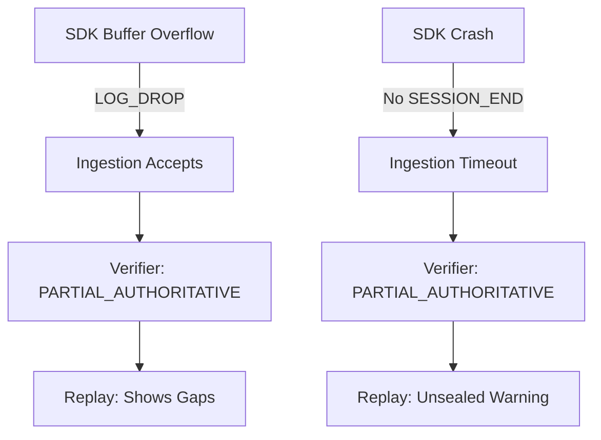
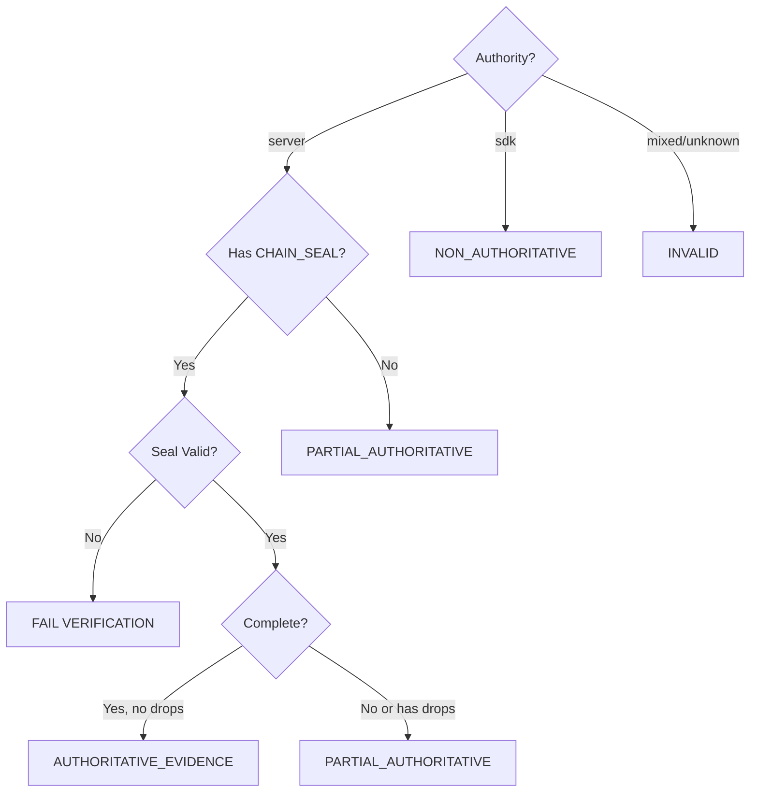

# FAILURE_MODES.md (v1.0)

## Purpose

This document enumerates failure modes for each major component of AgentOps Replay per Constitution.md Section 8 (Proof Obligations). Each component has:

1. A list of failure modes
2. Detection mechanisms
3. Recovery behavior
4. Impact on evidence quality
5. Explicit non-goals

---

## SDK Failure Modes

| Failure Mode          | Detection                        | Recovery                                   | Impact                                    | Evidence Class                                                |
| --------------------- | -------------------------------- | ------------------------------------------ | ----------------------------------------- | ------------------------------------------------------------- |
| **Buffer overflow**   | `LOG_DROP` event emitted         | Continue with gaps, track cumulative drops | Incomplete evidence, gaps in session      | PARTIAL_AUTHORITATIVE (if server), NON_AUTHORITATIVE (if SDK) |
| **SDK crash**         | No `SESSION_END` event           | Server timeout (ingestion closes session)  | Unsealed session                          | PARTIAL_AUTHORITATIVE (if server)                             |
| **Network partition** | `LOG_DROP` + delayed flush       | Retry queue, eventual consistency          | Delayed evidence, possible drops          | PARTIAL_AUTHORITATIVE if drops                                |
| **Clock skew**        | Server detects timestamp anomaly | Server timestamp wins                      | Metadata corrected, wall clock unreliable | No impact if minor                                            |
| **Mixed authority**   | Authority set size > 1           | INVALID, fail verification                 | Session rejected                          | N/A (invalid)                                                 |
| **Malformed events**  | Schema validation failure        | Event rejected by ingestion                | Partial session                           | PARTIAL_AUTHORITATIVE                                         |

### Post-Hoc Detection Guarantees

- **Buffer drops:** Detectable via `LOG_DROP` events with cumulative counters
- **Crashes:** Detectable via missing `SESSION_END`
- **Network loss:** Detectable via `LOG_DROP` or sequence gaps
- **Tampering:** Detectable via hash chain mismatch

### Explicit Non-Goals

The SDK will **NOT**:

- Guarantee delivery (fail open for agent execution)
- Retry indefinitely (bounded retry queue)
- Repair broken chains
- Infer or synthesize missing events

---

## Ingestion Service Failure Modes

| Failure Mode                     | Detection                            | Recovery                             | Impact                                  | Evidence Class        |
| -------------------------------- | ------------------------------------ | ------------------------------------ | --------------------------------------- | --------------------- |
| **Hash mismatch**                | `prev_hash` mismatch detected        | Reject event, return error to SDK    | Session marked invalid, chain broken    | FAIL verification     |
| **Duplicate sequence**           | Sequence number collision            | Reject duplicate, keep original      | Partial session, SDK warned             | PARTIAL_AUTHORITATIVE |
| **Schema version mismatch**      | Version check (`schema_ver != v0.6`) | Reject event, return error           | Compatibility error, session incomplete | FAIL or PARTIAL       |
| **Storage write failure**        | Database error                       | Event dropped (logged), SDK notified | Partial session, potential data loss    | PARTIAL_AUTHORITATIVE |
| **CHAIN_SEAL emission failure**  | Internal error during seal           | Session remains unsealed             | Incomplete session                      | PARTIAL_AUTHORITATIVE |
| **Timestamp ordering violation** | Monotonic clock regression           | Accept with warning, flag anomaly    | Metadata suspect                        | PARTIAL_AUTHORITATIVE |

### Post-Hoc Detection Guarantees

- **Hash mismatches:** Detectable by verifier via chain validation
- **Sequence gaps:** Detectable by verifier via monotonic sequence check
- **Missing seal:** Detectable by verifier, classified as PARTIAL_AUTHORITATIVE
- **Storage failures:** Logged in ingestion audit trail

### Explicit Non-Goals

The ingestion service will **NOT**:

- Infer missing events
- Repair broken chains
- Trust SDK-provided hashes without recomputation (server mode)
- Allow mixed authority in single session

---

## Verifier Failure Modes

| Failure Mode              | Detection                            | Recovery                      | Impact                                   | Evidence Class        |
| ------------------------- | ------------------------------------ | ----------------------------- | ---------------------------------------- | --------------------- |
| **MIXED_AUTHORITY**       | Authority set size > 1               | Fail verification immediately | Session invalid                          | FAIL                  |
| **CHAIN_BROKEN**          | Hash chain mismatch (prev_hash)      | Fail verification immediately | Tamper detected or data loss             | FAIL                  |
| **SEQUENCE_GAP**          | Missing sequence number              | Fail verification immediately | Data loss detected                       | FAIL                  |
| **MISSING_SEAL**          | No `CHAIN_SEAL` in server session    | Mark as PARTIAL_AUTHORITATIVE | Incomplete session, not compliance-grade | PARTIAL_AUTHORITATIVE |
| **INVALID_SEAL**          | CHAIN_SEAL missing required metadata | Fail verification             | Malformed seal, cannot trust authority   | FAIL                  |
| **PAYLOAD_HASH_MISMATCH** | Payload hash doesn't match canonical | Fail verification immediately | Tamper detected                          | FAIL                  |
| **EVENT_HASH_MISMATCH**   | Event hash doesn't match envelope    | Fail verification immediately | Tamper detected                          | FAIL                  |
| **POLICY_VIOLATION**      | Evidence class rejected by policy    | Fail verification             | Policy enforcement                       | FAIL                  |

### Post-Hoc Detection Guarantees

- **All hash mismatches:** Detectable via cryptographic validation
- **All sequence gaps:** Detectable via sequence number check
- **Mixed authority:** Detectable via authority set analysis
- **All seal issues:** Detectable via metadata validation

### Explicit Non-Goals

The verifier will **NOT**:

- Repair broken chains
- Infer missing data
- Auto-upgrade evidence classes
- Trust UI/SDK-provided evidence classification

---

## Replay Service Failure Modes

| Failure Mode               | Detection                        | Recovery                              | Impact                                     | Evidence Class        |
| -------------------------- | -------------------------------- | ------------------------------------- | ------------------------------------------ | --------------------- |
| **Missing events**         | Sequence gap in loaded events    | Partial replay, mark gaps             | Incomplete reconstruction                  | PARTIAL_AUTHORITATIVE |
| **Schema incompatibility** | Event schema version unsupported | Graceful degradation, skip event      | Feature unavailable (e.g., new event type) | PARTIAL_AUTHORITATIVE |
| **Timeout**                | Replay duration exceeded         | Cancel replay, return partial results | Resource protection, incomplete replay     | PARTIAL_AUTHORITATIVE |
| **LOG_DROP encountered**   | `LOG_DROP` event in stream       | Continue replay, mark incomplete      | Known gaps, declared data loss             | PARTIAL_AUTHORITATIVE |
| **Unsealed session**       | No `CHAIN_SEAL`                  | Replay proceeds, mark as partial      | Not compliance-grade                       | PARTIAL_AUTHORITATIVE |

### Post-Hoc Detection Guarantees

- **Gaps:** Replay UI shows gap markers
- **Drops:** `LOG_DROP` events visible in timeline
- **Incomplete:** Replay report shows evidence class

### Explicit Non-Goals

The replay service will **NOT**:

- Interpolate missing data
- Synthesize events
- Hide gaps or drops
- Claim completeness for incomplete sessions

---

## Cross-Component Failure Dependencies

### Cascading Failures

### Fail-Safe vs Fail-Closed

| Component | Failure Mode  | Behavior                         | Rationale                             |
| --------- | ------------- | -------------------------------- | ------------------------------------- |
| SDK       | Data loss     | **Fail-safe** (agent continues)  | Agent availability > log completeness |
| Ingestion | Hash mismatch | **Fail-closed** (reject event)   | Integrity > availability              |
| Verifier  | Chain broken  | **Fail-closed** (reject session) | Evidence quality > false confidence   |
| Replay    | Missing data  | **Fail-safe** (show partial)     | Partial evidence > no evidence        |

---

## Evidence Class Decision Tree

**Complete** = Has `SESSION_END` + No sequence gaps + No `LOG_DROP` events + Chain valid

---

## Amendment Process

This document is frozen at v1.0 for EVENT_LOG_SPEC v0.6.

Updates require:

1. New failure mode discovered in production
2. Constitutional approval (CONSTITUTION.md)
3. Test vectors added for new failure mode
4. Verifier updated to detect new failure mode

**Current Status:** FROZEN (v1.0)
**Effective:** EVENT_LOG_SPEC v0.6+
